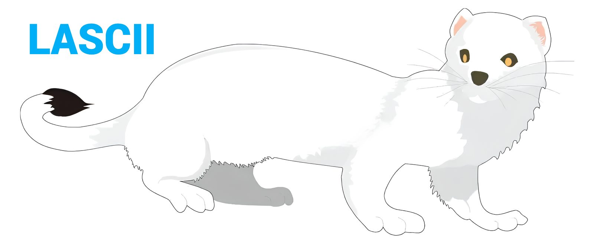

<div align="center">
  
</div>

<br>
<br>

<h2 align="center"> 2 STEPS TO INSTALL</h2>

### ***DOWNLOAD***

> [!IMPORTANT]
> This command must be entered in the directory with the "go.mod" file.
> Therefore, first create a project in which this framework will be used.

``` bash
go get 'github.com/lignigno/LASCII/v2@latest'
```

### ***INCLUDE***
``` go
"github.com/lignigno/LASCII/v2/lascii"
```

---

<br>
<br>

<h2 align="center"> INSTALL EXEMPLES </h2>

> [!IMPORTANT]
> After installing the examples, you need to check that "LASCII" is downloaded
> (see the instructions above)

``` bash
git clone https://github.com/lignigno/LASCII.git && \
LASCII/examples/install.sh
```

> [!TIP]
> For other fonts https://manytools.org/hacker-tools/ascii-banner/

---

<br>
<br>

<h2 align="center"> FUNCTIONS </h2>

``` go
// loading your custom fonts
func LoadFonts(fonts LoadingSettings_t) error

// check
func GetFontNames() []string

// create new font with shadows (or not)
func CreateFontMix(settings FontMixSettings_t) error

// align and may be max width
func SetPrintSettings(settings PrintSettings_t)

// setting all SGR table, color, bold, italic, etc. (ansi escape codes)
func SetSGRParam(sgrSettings *SGRSettings_t, param SGRParam_t, value SGRValue_t)
func ConvertColor2SGRValue(mode SGRColorMode_t, color Color_t) SGRValue_t

// create text for print
func CreateArt(fontName string, text []rune, lsb *LSB_t) ([][]rune, error)

// WILL BE SOON

// invert from "text for print" to simple "string"
// ConvertArt2text()
```
